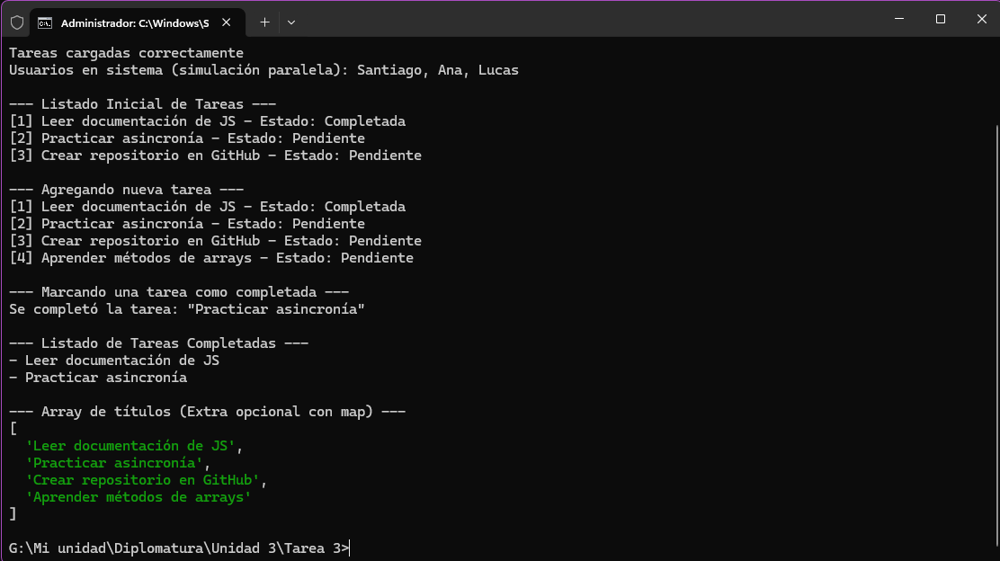

# Tarea - Javascript Avanzado

## Descripción y objetivos
Resolución de la Unidad 3 del módulo de Javascript Avanzado. 
Los objetivos principales de esta práctica son:
- Usar `setTimeout` y `Promise` para simular asincronía.
- Creación de clases en JavaScript con propiedades y métodos.
- Manipulación de datos utilizando los métodos de arrays `map`, `filter` y `find`.

## Instrucciones de instalación y ejecución
1. Clonar el repositorio en tu máquina local.
2. Es necesario tener instalado [Node.js](https://nodejs.org/).
3. Abrir una terminal y navegar hasta el directorio del proyecto.
4. Ejecutar el archivo JavaScript con el comando:
   ```bash
   node app.js
   ```

## Capturas de pantalla de la consola

*(Asegúrate de agregar la imagen `captura.png` mostrando la ejecución en tu consola antes de hacer push)*

## Créditos
Autor: Santiago

## Bibliografía utilizada y sugerida
- MDN Web Docs. (s.f.-a). Classes. Mozilla Corporation. https://developer.mozilla.org/en-US/docs/Web/JavaScript/Reference/Classes
- MDN Web Docs. (s.f.-b). Promise. Mozilla Corporation. https://developer.mozilla.org/en-US/docs/Web/JavaScript/Reference/Global_Objects/Promise
- MDN Web Docs. (s.f.-c). Array methods. Mozilla Corporation. https://developer.mozilla.org/en-US/docs/Web/JavaScript/Reference/Global_Objects/Array
- Flanagan, D. JavaScript: The Definitive Guide. Master the World's Most-Used Programming Language. 7ª ed. Estados Unidos: O’Reilly Media; 2020.
- Freeman, E. y Robson E. Head First. JavaScript Programming. 1ª ed. Estados Unidos: O’Reilly Media; 2014.
